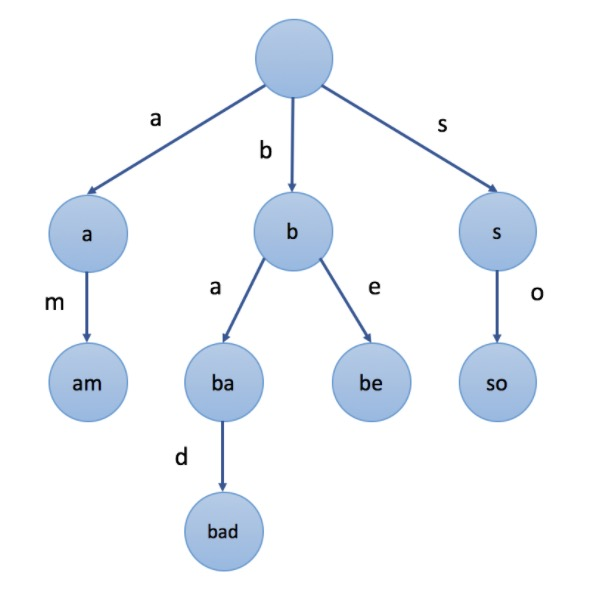

## 字符串分析算法
### 前缀树
##### 什么是前缀树？
> 前缀树 是 N叉树 的一种特殊形式。通常来说，一个前缀树是用来 存储字符串 的。前缀树的每一个节点代表一个 字符串（前缀）。每一个节点会有多个子节点，通往不同子节点的路径上有着不同的字符。子节点代表的字符串是由节点本身的 原始字符串 ，以及 通往该子节点路径上所有的字符 组成的。
> ⚠️注意：根节点表示空字符串

* 图例


* 特点
节点所有的后代都与该节点相关的字符串有着共同的前缀。例如 ```ba``` 和 ```be``` 有共同的前缀 ```b```。

* 应用
自动补全，拼写检查等

##### 实现

实现思路：
> 如果我们在前缀树中插入一个字符串 S，我们要从根节点开始。 我们将根据 S[0]（S中的第一个字符），选择一个子节点或添加一个新的子节点。然后到达第二个节点，并根据 S[1] 做出选择。 再到第三个节点，以此类推。 最后，我们依次遍历 S 中的所有字符并到达末尾。 末端节点将是表示字符串 S 的节点。

核心代码：
```javascript
class Trie {
  constructor() {
    // 初始化根节点
    this.root = Object.create(null);
  }

  // 以树的形式给节点添加新节点
  insert(word) {
    let node = this.root;
    for (let c of word) {
      if (!node[c]) {
        node[c] = Object.create(null);
      }
      node = node[c];
    }
  }
}
```

### kmp
在长字符串里找模式
<!-- ### 算法思想 -->

##### 实现思路
利用模式串自重复的特性，提高匹配效率

### Wildcard
带通配符的字符串模式
<!-- ### 算法思想 -->

##### 实现思路
1. 记录 * 号数量。如数量为 0，则判断模式串与原串是否完全匹配；
2. 对比第一个 * 号前的字符串是否匹配；
3. 循环比较后面跟 * 号（不包括最后一个）拼接的字符串是否匹配；
4. 判断最后一个 * 号后面的字符串是否匹配。


### 正则
字符串通用模式匹配

### 状态机
通用的字符串分析

### LL LR
字符串多层级结构分析

## 课堂笔记
##### 为什么 Object.create(null) 比 直接定义 {} 纯净？


定义：
```Object.create()```方法创建一个新对象，使用现有的对象来提供新创建的对象的__proto__。
返回值：
一个新对象，带着**指定的原型对象**和属性
