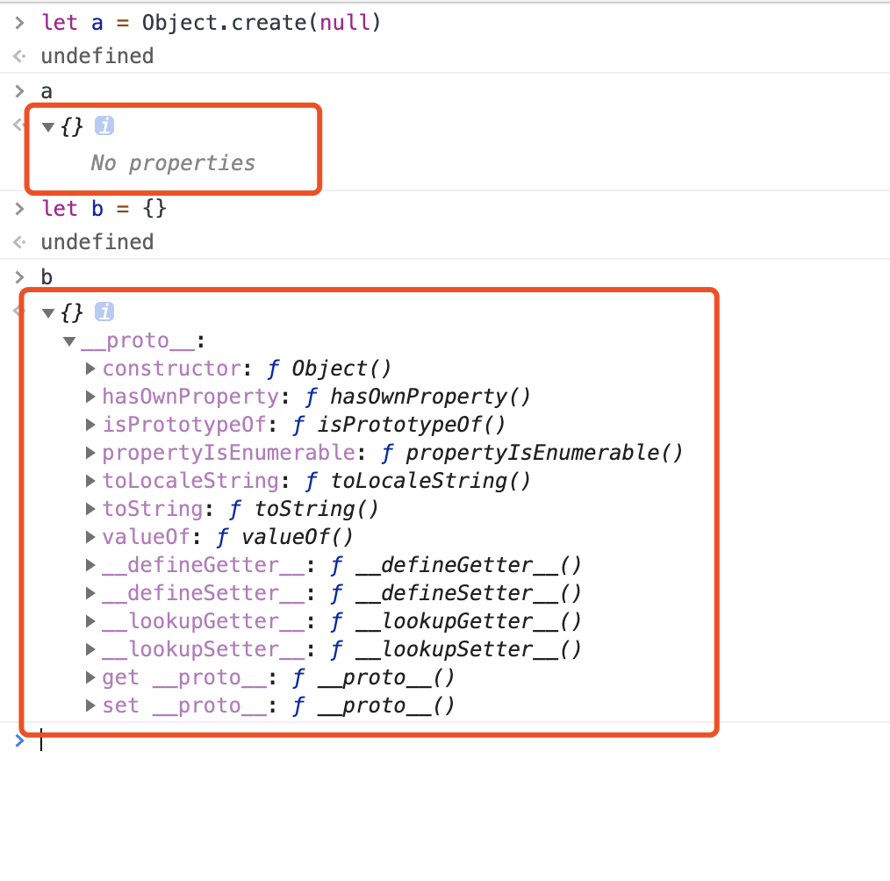

## 字符串分析算法
### 字典树
大量高重复字符串的存储与分析
<!-- ### 算法思想 -->

##### 实现思路
以树的形式给节点添加新节点

### kmp
在长字符串里找模式
<!-- ### 算法思想 -->

##### 实现思路
利用模式串自重复的特性，提高匹配效率

### Wildcard
带通配符的字符串模式
<!-- ### 算法思想 -->

##### 实现思路
1. 记录 * 号数量。如数量为 0，则判断模式串与原串是否完全匹配；
2. 对比第一个 * 号前的字符串是否匹配；
3. 循环比较后面跟 * 号（不包括最后一个）拼接的字符串是否匹配；
4. 判断最后一个 * 号后面的字符串是否匹配。


### 正则
字符串通用模式匹配

### 状态机
通用的字符串分析

### LL LR
字符串多层级结构分析

## 课堂笔记
##### 为什么 Object.create(null) 比 直接定义 {} 纯净？


定义：
```Object.create()```方法创建一个新对象，使用现有的对象来提供新创建的对象的__proto__。
返回值：
一个新对象，带着**指定的原型对象**和属性
