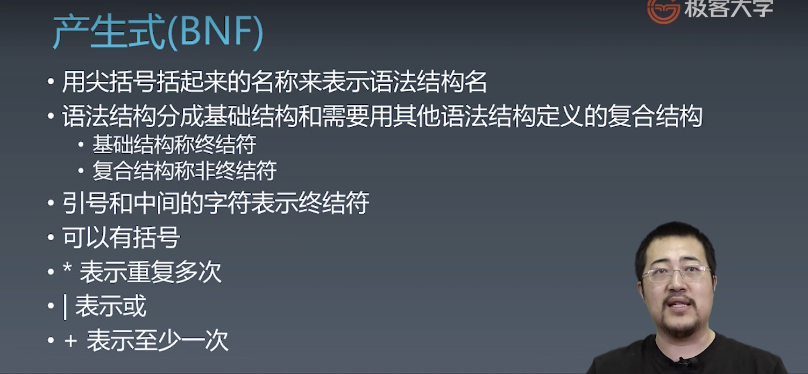
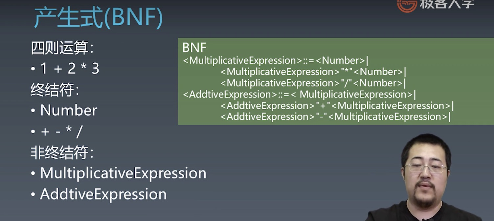
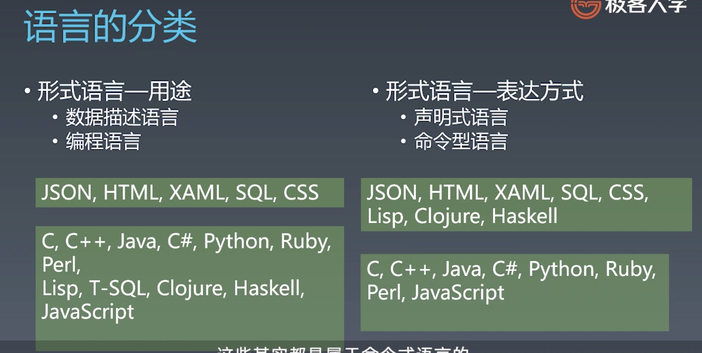

学习笔记
# JS语言通识
## [乔姆斯基谱系](https://zh.wikipedia.org/wiki/%E4%B9%94%E5%A7%86%E6%96%AF%E5%9F%BA%E8%B0%B1%E7%B3%BB)
是计算机科学中刻画形式文法表达能力的一个分类谱系，是由诺姆·乔姆斯基于 1956 年提出的。它包括四个层次：
- 0- 型文法（无限制文法或短语结构文法）包括所有的文法。
- 1- 型文法（上下文相关文法）生成上下文相关语言。
- 2- 型文法（上下文无关文法）生成上下文无关语言。
- 3- 型文法（正规文法）生成正则语言。


## 产生式
在计算机中指 Tiger 编译器将源程序经过词法分析（Lexical Analysis）和语法分析（Syntax Analysis）后得到的一系列符合文法规则（Backus-Naur Form，BNF）的语句。




练习：编写带括号的四则运算的产生式
```javascript
<MultiplicativeExpression>::=<Number>|
  <BracketiveExpression>｜
  <MultiplicativeExpression>"*"<Number>|
  <MultiplicativeExpression>"/"<Number>|

<AddtiveExpression>::=<MultiplicativeExpression>|
  <AddtiveExpression>"+"<MultiplicativeExpression>|
  <AddtiveExpression>"-"<MultiplicativeExpression>｜

<BracketiveExpression>::="("
  <AddtiveExpression>"+"<MultiplicativeExpression>|
  <AddtiveExpression>"-"<MultiplicativeExpression>
")"
```


## [巴科斯诺尔范式](https://zh.wikipedia.org/wiki/%E5%B7%B4%E7%A7%91%E6%96%AF%E8%8C%83%E5%BC%8F)
即巴科斯范式（英语：Backus Normal Form，缩写为 BNF）是一种用于表示上下文无关文法的语言，上下文无关文法描述了一类形式语言。它是由约翰·巴科斯（John Backus）和彼得·诺尔（Peter Naur）首先引入的用来描述计算机语言语法的符号集。


## 终结符
最终在代码中出现的字符（ https://zh.wikipedia.org/wiki/終結符與非終結符)

## 语言的分类


练习：尽可能寻找你知道的计算机语言，尝试把它们分类


## 对象
任何一个对象都是唯一的，这与它本身的状态无关。  
我们用状态描述对象。  
我们状态的改变即是行为。

三要素：唯一标识，状态，行为。

练习：用 JavaScript 去设计狗咬人的代码

！！！划重点：  
在设计对象的状态和行为时，我们总是遵循 __行为改变状态__ 的原则

```javascript
// 狗咬人 对狗并没有状态改变
class Dog {
  bite(something) {
    // ...
  }
}

// 狗咬人 对人有状态改变
// 且人可能被狗咬，被老虎咬，被划伤等等，所以可以定义为受伤
class Human{
  hurt(damage) {
    // ...
  }
}
```
