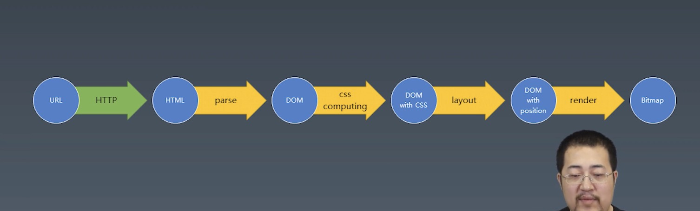

# 状态机
## 有限状态机
- 每一个状态都是一个机器
  - 在每一个机器里，我们可以做计算、存储、输出...
  - 所有的这些机器接受的输入是一致的
  - 状态机的每一个机器本身没有状态，如果我们用函数来表示的话，它应该是纯函数（无副作用）
- 每一个机器知道下一个状态
  - 每个机器都有确定的下一个状态（Moore）
  - 每个机器根据输入决定下一个状态（Mealy）

### Mealy 状态机
代码示例：
```javascript
// 每个函数是一个状态
function state (input) {
	// 在函数中，可以自由编写代码，处理每个状态的逻辑
	return next;  // 返回值作为下一个状态
}

// 调用
while(input) {
	// 获取输入
	state = state(input);  // 把状态机的返回值作为下一个状态
}
```

# 浏览器工作原理
## 浏览器渲染原理


浏览器解析网络资源，最后生成一张图片形式内容（Bitmap），传给显卡驱动设备，显示给用户。

## HTTP解析
### ISO-OSI七层网络模型
|OSI|对应|node|
|--|--|--|
|应用|HTTP|require('http')|
|表示|HTTP|require('http')|
|会话|HTTP|require('http')|
|传输|TCP|require('net')|
|网络|Internet|
|数据链路|4G/5G/Wifi|
|物理|4G/5G/Wifi|

数据链路层，物理层：主要完成数据的传输。

### HTTP协议

http协议，是文本型协议，协议内容都是字符串

Request: ------ line：POST /HTTP/1.1  
headers: ------ Host:127.0.0.1    
         ------ Content-Type: application/x-www-form-urlencoded   
(headers以空行为标志结束)   
body:    ------ (由content-type决定格式)


HTTP换行符都是由 \r\n 组成

# 实现 URL -> HTML

