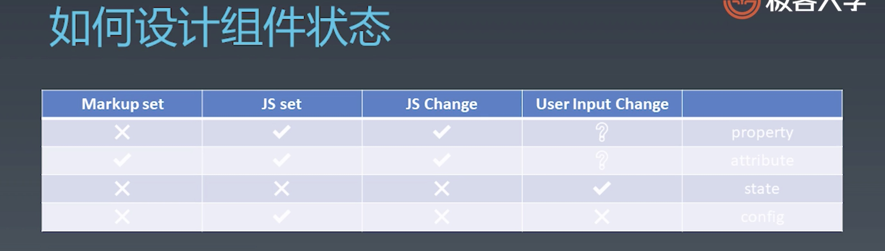
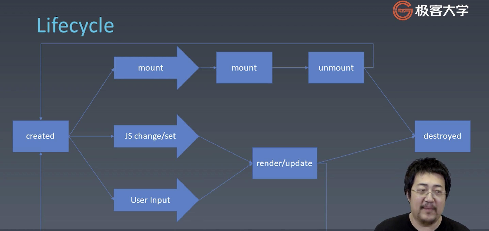

# 组件的基本知识
模块&对象&组件   
一般来说，组件是跟 UI 强相关的东西，可以以树形结构进行组合，有一定的模板化配置能力。
1. 对象
- Properties
- Methods
- Inherit

2. 组件
- Properties
- Methods
- Inherit
- Attribute
- Config & State   
  config: 给组件传的一些参数   
  state: 用户改变组件的状态
- Event   
  组件向外通信
- Lifecycle
- Children

## 组件
1. 如何设计组件状态

2. 组件的生命周期

